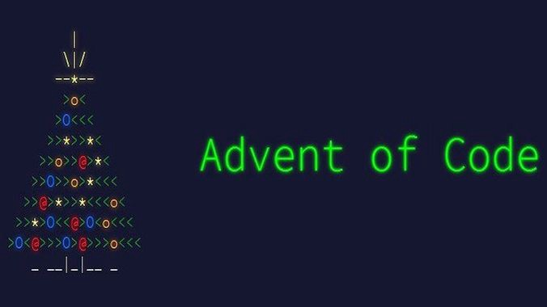

# 🎄 Advent of Code 2022 🎄

## Summary

[Advent of Code](http://adventofcode.com/) is an annual Advent calendar of programming puzzles.

## Discussions
For every day, there is a GitHub discussion created to share your thoughts, ask for help or just chat for fun!
[Go to the discussions](https://github.com/RoyalAholdDelhaize/adventofcode-2022/discussions)

## Participate

If you want to participate, you can run the [workflow](https://github.com/RoyalAholdDelhaize/adventofcode-2022/actions/workflows/add-participant.yml) in this repository with the given input fields (your full name and language). After the workflow has run, a branch is created for you where you can put your code.
The can rename the sample folder replacing `XX` with the day number, `01` - `25`.

You can also join our [private-leaderboard](https://adventofcode.com/2022/leaderboard/private) with the following code: `177751-2ce47adb`

## Participants

| Name | Language |
| ---- | -------- |
[Thijs van Tol](https://github.com/RoyalAholdDelhaize/adventofcode-2022/tree/thijsvtol/Python) | Python |
[Johan Pelgrim](https://github.com/RoyalAholdDelhaize/adventofcode-2022/tree/jpelgrim/Dart) | Dart |
[Jan van den Berg](https://github.com/RoyalAholdDelhaize/adventofcode-2022/tree/koozz/rust) | Rust |
[Tijmen Stor](https://github.com/RoyalAholdDelhaize/adventofcode-2022/tree/Tijmen34/Go) | Go |
[Philipp Gayret](https://github.com/RoyalAholdDelhaize/adventofcode-2022/tree/SkPhilipp/Bash) | Bash |
[Vincent Weber](https://github.com/RoyalAholdDelhaize/adventofcode-2022/tree/vweber/Typescript) | Typescript |
[Reinier Timmer](https://github.com/RoyalAholdDelhaize/adventofcode-2022/tree/reiniertimmer/ruby) | ruby |
[Jeroen Bouma](https://github.com/RoyalAholdDelhaize/adventofcode-2022/tree/jeroenboumareturns/Dart) | Dart |
